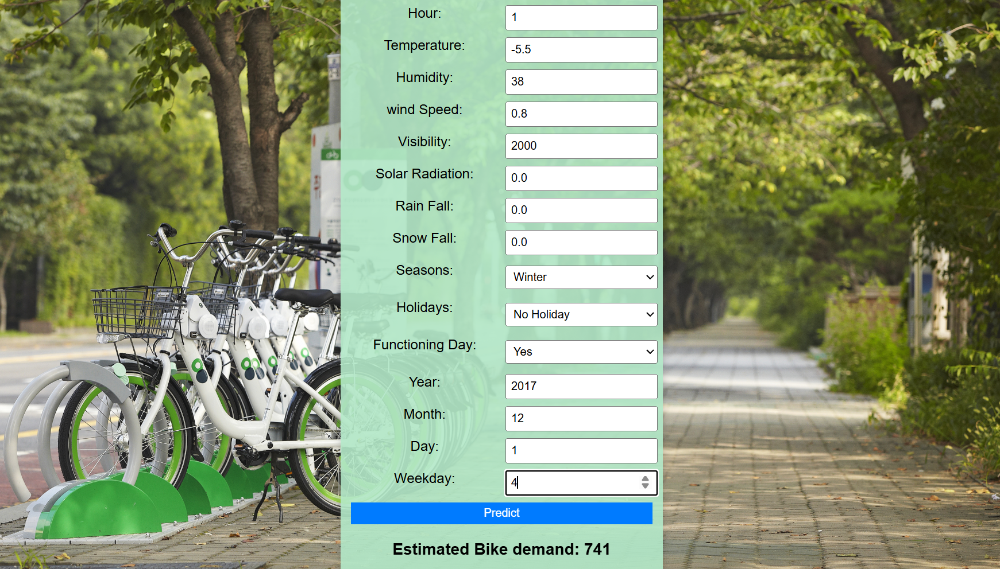

## 🚲 Seoul Bike Sharing Demand Prediction

This project is a Machine Learning web application built using **FastAPI** that predicts bike rental demand in Seoul based on weather conditions, seasonal information, and calendar features.

The model was trained using **scikit-learn** with preprocessing handled through a **Pipeline and ColumnTransformer** (including scaling and One-Hot Encoding).

The trained model is deployed through a **FastAPI web interface** where users can input feature values and receive real-time predictions.

## 🧠 Features Used

Hour

Temperature

Humidity

Wind Speed

Visibility

Solar Radiation

Rainfall

Snowfall

Seasons

Holiday

Functioning Day

Year, Month, Day, Weekday

## 🛠 Tech Stack

Python

FastAPI

Uvicorn

Pandas

NumPy

Scikit-learn

Jinja2

HTML / CSS

## 🚀 How to Run Locally

Clone the repository

Install dependencies:

pip install -r requirements.txt

Run the application:

uvicorn app:app --reload

Open your browser:

http://127.0.0.1:8000

## 📌 Project Highlights

End-to-end ML pipeline

Categorical feature handling using OneHotEncoder

FastAPI-based web interface for real-time predictions

Deployment-ready structure

## 🌐 Live Demo

https://seoul-bike-fastapi-app.onrender.com

## 📸 Application Preview

## 📌 Project Overview

An end-to-end Machine Learning project that predicts bike rental demand in Seoul using weather and calendar features, deployed as a FastAPI web application for real-time predictions.

## Dataset

Dataset: Seoul Bike Sharing Demand Dataset

## Note

Note: App hosted on Render free tier. First load may take ~30 seconds.

## 👤 Author
White | GitHub: CodeDaniel23
